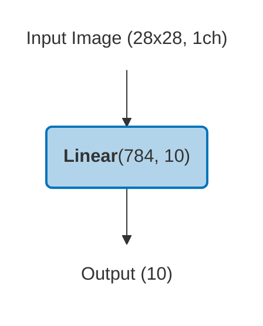
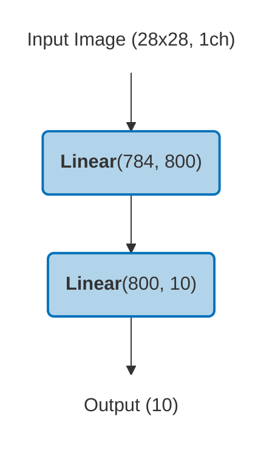
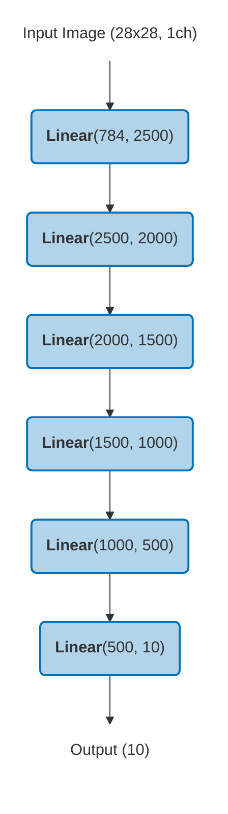
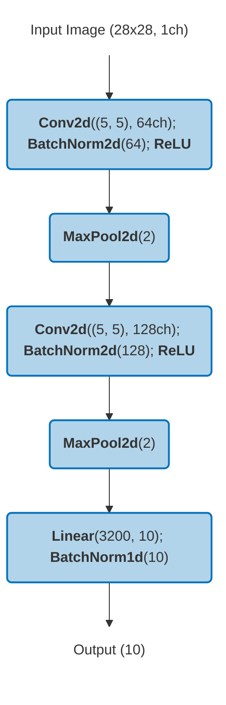
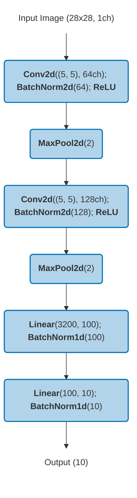
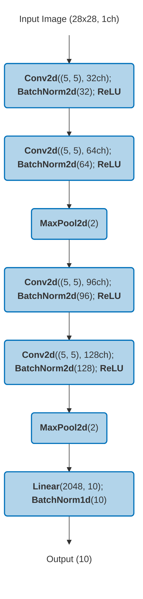

# MNIST Learning Playground

This repository contains a collection of Machine Learning / Deep Learning models trained on the [MNIST](http://yann.lecun.com/exdb/mnist/) dataset. The main goal is to study **accuracy variance** across hundreds of training runs (different random seeds) for each architecture, enabling statistical analysis of how model complexity and hyperparameters affect result distributions.

Although intuitively one might expect that very low variance could indicate training stagnation or overfitting, the analyses performed in this project show **no clear correlation** between low variance and overfitting behavior. Dedicated overfitting experiments (training on reduced datasets with aggressive hyperparameters) confirm that the observed variance patterns are not simply an artifact of overfitting.

This work makes use of the research presented in:

> Heredia-Aguado, E.; Cabrera, J.J.; Jiménez, L.M.; Valiente, D.; Gil, A. *Static Early Fusion Techniques for Visible and Thermal Images to Enhance Convolutional Neural Network Detection: A Performance Analysis*. **Remote Sens.** 2025, 17(6), 1060. [https://doi.org/10.3390/rs17061060](https://doi.org/10.3390/rs17061060)

---

## Table of Contents

- [MNIST Learning Playground](#mnist-learning-playground)
  - [Table of Contents](#table-of-contents)
  - [Installation](#installation)
  - [Models](#models)
    - [SimplePerceptron](#simpleperceptron)
    - [HiddenLayerPerceptron](#hiddenlayerperceptron)
    - [DNN\_6L](#dnn_6l)
    - [CNN\_3L](#cnn_3l)
    - [CNN\_4L](#cnn_4l)
    - [CNN\_5L](#cnn_5l)
    - [CNN\_14L](#cnn_14l)
    - [BatchNormMaxoutNetInNet](#batchnormmaxoutnetinnet)
    - [YOLOv8](#yolov8)
  - [Project Structure](#project-structure)
  - [Scripts Overview](#scripts-overview)
    - [Training](#training)
    - [Analysis](#analysis)
    - [Utilities](#utilities)
    - [Shell Helpers](#shell-helpers)
  - [Output \& Results](#output--results)

---

## Installation

It is recommended to use a Python virtual environment. Clone the repository and run:

```sh
python3 -m venv venv
source venv/bin/activate
pip install -r requirements
```

---

## Models

Eight architectures of increasing complexity are included, from a single-layer perceptron to a 14-layer CNN. All models inherit from `BaseModelTrainer` which provides early stopping, best-model checkpointing, and per-epoch metric tracking.

| Model | Layers | Total Params | Trainable Params | Memory (MB) |
|:------|-------:|-------------:|-----------------:|------------:|
| SimplePerceptron | 2 | 7,850 | 7,850 | 0.0 |
| HiddenLayerPerceptron | 3 | 636,010 | 636,010 | 2.4 |
| DNN_6L | 7 | 11,972,510 | 11,972,510 | 45.7 |
| CNN_14L | 47 | 5,497,226 | 5,497,226 | 21.0 |
| CNN_3L | 14 | 239,006 | 239,006 | 0.9 |
| CNN_4L | 16 | 528,306 | 528,306 | 2.0 |
| CNN_5L | 20 | 534,270 | 534,270 | 2.0 |
| BatchNormMaxoutNetInNet | 46 | 425,220 | 425,220 | 1.6 |
| YOLOv8m | 295 | 25,856,899 | 25,856,883 | 98.6 |

### SimplePerceptron

A single fully-connected layer — the simplest possible baseline. 

*Check model implementation in [SimplePerceptron.py](src/models/SimplePerceptron.py).*



### HiddenLayerPerceptron

One hidden layer with 800 neurons. 

*Check model implementation in [HiddenLayerPerceptron.py](src/models/HiddenLayerPerceptron.py).*



### DNN_6L

A 6-layer deep neural network with decreasing layer sizes (2500 → 10). 

*Check model implementation in [DNN_6L.py](src/models/DNN_6L.py).*



### [CNN_3L](src/models/CNN_3L.py)

A compact CNN with 2 conv blocks (5×5 kernels, BatchNorm, ReLU, MaxPool) and one FC layer. 

*Check model implementation in [CNN_3L.py](src/models/CNN_3L.py).*



### CNN_4L

Similar to CNN_3L but adds an extra FC hidden layer (100 neurons). 

*Check model implementation in [CNN_4L.py](src/models/CNN_4L.py).*



### CNN_5L

A deeper CNN with 4 conv layers (5×5 kernels, increasing channels 32→128) and 2 MaxPool stages. 

*Check model implementation in [CNN_5L.py](src/models/CNN_5L.py).*



### CNN_14L

A large 14-layer CNN with 3×3 kernels, groups of repeated conv blocks (indicated by **×N**), a 1×1 bottleneck expansion to 2048 channels, and a single FC output. 

*Check model implementation in [CNN_14L.py](src/models/CNN_14L.py).*

```mermaid
flowchart TD
    input_image("Input Image (28x28, 1ch)"):::noBox
    Conv2d_0_Sequential_conv_layers("<b>Conv2d</b>((3, 3), 64ch); <b>BatchNorm2d</b>(64); <b>ReLU</b>"):::blockStyle
    Conv2d_3_Sequential_conv_layers("<b>Conv2d</b>((3, 3), 128ch); <b>BatchNorm2d</b>(128); <b>ReLU</b>"):::blockStyle
    MaxPool2d_6_Sequential_conv_layers("<b>MaxPool2d</b>(2)"):::blockStyle
    subgraph subgraph_4 [" "]
        subgraph_4_count("<b>x4</b>"):::noBox
        subgraph_4_block("<b>Conv2d</b>((3, 3), 128ch); <b>BatchNorm2d</b>(128); <b>ReLU</b>"):::blockStyle
    end
    style subgraph_4 fill:#a664974D,stroke:#a66497,stroke-width:2px,rx:10px,ry:10px
    Conv2d_19_Sequential_conv_layers("<b>Conv2d</b>((3, 3), 256ch); <b>BatchNorm2d</b>(256); <b>ReLU</b>"):::blockStyle
    MaxPool2d_22_Sequential_conv_layers("<b>MaxPool2d</b>(2)"):::blockStyle
    subgraph subgraph_10 [" "]
        subgraph_10_count("<b>x2</b>"):::noBox
        subgraph_10_block("<b>Conv2d</b>((3, 3), 256ch); <b>BatchNorm2d</b>(256); <b>ReLU</b>"):::blockStyle
    end
    style subgraph_10 fill:#a664974D,stroke:#a66497,stroke-width:2px,rx:10px,ry:10px
    Conv2d_29_Sequential_conv_layers("<b>Conv2d</b>((3, 3), 512ch); <b>BatchNorm2d</b>(512); <b>ReLU</b>"):::blockStyle
    Conv2d_32_Sequential_conv_layers("<b>Conv2d</b>((1, 1), 2048ch); <b>BatchNorm2d</b>(2048); <b>ReLU</b>"):::blockStyle
    Conv2d_35_Sequential_conv_layers("<b>Conv2d</b>((1, 1), 256ch); <b>BatchNorm2d</b>(256); <b>ReLU</b>"):::blockStyle
    MaxPool2d_38_Sequential_conv_layers("<b>MaxPool2d</b>(2)"):::blockStyle
    Conv2d_39_Sequential_conv_layers("<b>Conv2d</b>((3, 3), 256ch); <b>BatchNorm2d</b>(256); <b>ReLU</b>"):::blockStyle
    Linear_0_Sequential_fc_layers("<b>Linear</b>(256, 10)"):::blockStyle
    output("Output (10)"):::noBox

    classDef blockStyle fill:#0171ba4D,stroke:#0171ba,stroke-width:2px
    classDef noBox fill:none,stroke:none;

    input_image --> Conv2d_0_Sequential_conv_layers
    Conv2d_0_Sequential_conv_layers --> Conv2d_3_Sequential_conv_layers
    Conv2d_3_Sequential_conv_layers --> MaxPool2d_6_Sequential_conv_layers
    MaxPool2d_6_Sequential_conv_layers --> subgraph_4
    subgraph_4 --> Conv2d_19_Sequential_conv_layers
    Conv2d_19_Sequential_conv_layers --> MaxPool2d_22_Sequential_conv_layers
    MaxPool2d_22_Sequential_conv_layers --> subgraph_10
    subgraph_10 --> Conv2d_29_Sequential_conv_layers
    Conv2d_29_Sequential_conv_layers --> Conv2d_32_Sequential_conv_layers
    Conv2d_32_Sequential_conv_layers --> Conv2d_35_Sequential_conv_layers
    Conv2d_35_Sequential_conv_layers --> MaxPool2d_38_Sequential_conv_layers
    MaxPool2d_38_Sequential_conv_layers --> Conv2d_39_Sequential_conv_layers
    Conv2d_39_Sequential_conv_layers --> Linear_0_Sequential_fc_layers
    Linear_0_Sequential_fc_layers --> output
```

<details>
<summary>Click to expand architecture diagram</summary>



</details>

### BatchNormMaxoutNetInNet

A Network-in-Network architecture with 3 MINBlocks, each containing Conv → 1×1 Conv → MaxOut → 1×1 Conv → MaxOut → AvgPool → Dropout. 

*Check model implementation in [BatchNormMaxoutNetInNet.py](src/models/BatchNormMaxoutNetInNet.py).*

```mermaid
flowchart TD
    input_image("Input Image (28x28, 1ch)"):::noBox
    Conv2d_conv_MINBlock_block1("<b>Conv2d</b>((5, 5), 128ch); <b>BatchNorm2d</b>(128)"):::blockStyle
    Conv2d_0_Sequential_mlp1_MINBlock_block1("<b>Conv2d</b>((1, 1), 96ch)"):::blockStyle
    MaxOutLayer_1_Sequential_mlp1_MINBlock_block1("<b>MaxOutLayer</b>(96, 96; k=5); <b>BatchNorm2d</b>(96)"):::blockStyle
    Conv2d_0_Sequential_mlp2_MINBlock_block1("<b>Conv2d</b>((1, 1), 48ch)"):::blockStyle
    MaxOutLayer_1_Sequential_mlp2_MINBlock_block1("<b>MaxOutLayer</b>(48, 48; k=5); <b>BatchNorm2d</b>(48)"):::blockStyle
    AvgPool2d_pool_MINBlock_block1("<b>AvgPool2d</b>(3; s:2, p=0)"):::blockStyle
    Dropout_dropout_MINBlock_block1("<b>Dropout</b>(0.5)"):::blockStyle
    Conv2d_conv_MINBlock_block2("<b>Conv2d</b>((5, 5), 128ch); <b>BatchNorm2d</b>(128)"):::blockStyle
    Conv2d_0_Sequential_mlp1_MINBlock_block2("<b>Conv2d</b>((1, 1), 96ch)"):::blockStyle
    MaxOutLayer_1_Sequential_mlp1_MINBlock_block2("<b>MaxOutLayer</b>(96, 96; k=5); <b>BatchNorm2d</b>(96)"):::blockStyle
    Conv2d_0_Sequential_mlp2_MINBlock_block2("<b>Conv2d</b>((1, 1), 48ch)"):::blockStyle
    MaxOutLayer_1_Sequential_mlp2_MINBlock_block2("<b>MaxOutLayer</b>(48, 48; k=5); <b>BatchNorm2d</b>(48)"):::blockStyle
    AvgPool2d_pool_MINBlock_block2("<b>AvgPool2d</b>(3; s:2, p=0)"):::blockStyle
    Dropout_dropout_MINBlock_block2("<b>Dropout</b>(0.5)"):::blockStyle
    Conv2d_conv_MINBlock_block3("<b>Conv2d</b>((3, 3), 128ch); <b>BatchNorm2d</b>(128)"):::blockStyle
    Conv2d_0_Sequential_mlp1_MINBlock_block3("<b>Conv2d</b>((1, 1), 96ch)"):::blockStyle
    MaxOutLayer_1_Sequential_mlp1_MINBlock_block3("<b>MaxOutLayer</b>(96, 96; k=5); <b>BatchNorm2d</b>(96)"):::blockStyle
    Conv2d_0_Sequential_mlp2_MINBlock_block3("<b>Conv2d</b>((1, 1), 10ch)"):::blockStyle
    MaxOutLayer_1_Sequential_mlp2_MINBlock_block3("<b>MaxOutLayer</b>(10, 10; k=5); <b>BatchNorm2d</b>(10)"):::blockStyle
    AvgPool2d_pool_MINBlock_block3("<b>AvgPool2d</b>(1; s:1, p=0)"):::blockStyle
    Dropout_dropout_MINBlock_block3("<b>Dropout</b>(0.0)"):::blockStyle
    output("Output (10)"):::noBox

    classDef blockStyle fill:#0171ba4D,stroke:#0171ba,stroke-width:2px
    classDef noBox fill:none,stroke:none;

    input_image --> Conv2d_conv_MINBlock_block1
    Conv2d_conv_MINBlock_block1 --> Conv2d_0_Sequential_mlp1_MINBlock_block1
    Conv2d_0_Sequential_mlp1_MINBlock_block1 --> MaxOutLayer_1_Sequential_mlp1_MINBlock_block1
    MaxOutLayer_1_Sequential_mlp1_MINBlock_block1 --> Conv2d_0_Sequential_mlp2_MINBlock_block1
    Conv2d_0_Sequential_mlp2_MINBlock_block1 --> MaxOutLayer_1_Sequential_mlp2_MINBlock_block1
    MaxOutLayer_1_Sequential_mlp2_MINBlock_block1 --> AvgPool2d_pool_MINBlock_block1
    AvgPool2d_pool_MINBlock_block1 --> Dropout_dropout_MINBlock_block1
    Dropout_dropout_MINBlock_block1 --> Conv2d_conv_MINBlock_block2
    Conv2d_conv_MINBlock_block2 --> Conv2d_0_Sequential_mlp1_MINBlock_block2
    Conv2d_0_Sequential_mlp1_MINBlock_block2 --> MaxOutLayer_1_Sequential_mlp1_MINBlock_block2
    MaxOutLayer_1_Sequential_mlp1_MINBlock_block2 --> Conv2d_0_Sequential_mlp2_MINBlock_block2
    Conv2d_0_Sequential_mlp2_MINBlock_block2 --> MaxOutLayer_1_Sequential_mlp2_MINBlock_block2
    MaxOutLayer_1_Sequential_mlp2_MINBlock_block2 --> AvgPool2d_pool_MINBlock_block2
    AvgPool2d_pool_MINBlock_block2 --> Dropout_dropout_MINBlock_block2
    Dropout_dropout_MINBlock_block2 --> Conv2d_conv_MINBlock_block3
    Conv2d_conv_MINBlock_block3 --> Conv2d_0_Sequential_mlp1_MINBlock_block3
    Conv2d_0_Sequential_mlp1_MINBlock_block3 --> MaxOutLayer_1_Sequential_mlp1_MINBlock_block3
    MaxOutLayer_1_Sequential_mlp1_MINBlock_block3 --> Conv2d_0_Sequential_mlp2_MINBlock_block3
    Conv2d_0_Sequential_mlp2_MINBlock_block3 --> MaxOutLayer_1_Sequential_mlp2_MINBlock_block3
    MaxOutLayer_1_Sequential_mlp2_MINBlock_block3 --> AvgPool2d_pool_MINBlock_block3
    AvgPool2d_pool_MINBlock_block3 --> Dropout_dropout_MINBlock_block3
    Dropout_dropout_MINBlock_block3 --> output
```

<details>
<summary>Click to expand architecture diagram</summary>



</details>

### YOLOv8

As an extension of the study to a more complex domain, **YOLOv8m** (medium variant, 3-channel input) is also trained for object detection using the [COCO](https://cocodataset.org/) dataset. Multiple static image fusion methods are explored to evaluate their impact on detection variance. Training and management of YOLO experiments is handled through a separate repository: [yolo_test_utils](https://github.com/enheragu/yolo_test_utils).

The analysis scripts in this repo (`src/check_yolo_results.py`) consume the YOLO training outputs to perform the same statistical analyses (switched probability, survival functions, distribution plots, ablation tests) applied to the MNIST models.

---

## Project Structure

```
├── src/
│   ├── 00_train_models.py … 07_check_overfit_analysis.py   # Pipeline scripts
│   ├── check_*.py                                          # Auxiliary utilities
│   ├── models/                                             # Model architectures (BaseModel + 8 models)
│   └── utils/                                              # Shared helpers
├── data/MNIST/                   # Dataset (auto-downloaded)
├── output_data/                  # Checkpoints & per-seed metrics (.yaml)
├── analysis_results/             # Generated plots, tables & diagrams
├── 01_run_tmux.sh                # Parallel training launcher
├── 02_monitor_tmux.sh            # tmux monitoring dashboard
└── requirements                  # pip dependencies
```

---

## Scripts Overview

The pipeline is organized in numbered scripts that can be run sequentially. Additional `check_*` scripts provide auxiliary exploration and visualization.

### Training

| Script | Description |
|--------|-------------|
| `src/00_train_models.py` | **Main training loop.** Trains all 8 architectures on MNIST for 400 iterations each (different random seeds) with lr=0.001, patience=10, and up to 500 epochs per run. Also includes batch-size variants (CNN_14L_B10/B25/B50/B80). |
| `src/01_train_ablation_test.py` | **Ablation study.** Trains CNN_14L under 9 combinations of batch size (10, 40, 70) × learning rate (0.01, 0.001, 0.005) for 310 iterations to check whether inter-model distances are invariant to hyperparameter changes. |
| `src/06_train_overfit_test.py` | **Overfitting study.** Trains CNN_14L and DNN_6L on a reduced dataset (2% of MNIST) with aggressive lr=0.1 and patience=40 to deliberately induce overfitting (400 iterations each). |

### Analysis

| Script | Description |
|--------|-------------|
| `src/02_compute_analysis.py` | **Core statistical analysis.** Computes estimation errors, Monte Carlo simulations (how many trials to beat a given percentile), switched-probability analysis, and sampling error/percentile-probability graphs. |
| `src/03_plot_distribution.py` | **Distribution plots.** Plots accuracy distributions across trained models, normality tests, amplitude analysis, survival functions, and parameter-count vs. amplitude scatter plots. |
| `src/04_check_distances.py` | **Inter-model distances.** Loads published MNIST error rates from the literature and compares them against the observed accuracy distributions from trained models. |
| `src/05_check_ablation_test.py` | **Ablation analysis.** Runs repeated-measures ANOVA, mixed linear models, Kendall's W, percentile analysis, and interaction plots across the 9 hyperparameter conditions. |
| `src/07_check_overfit_analysis.py` | **Overfitting analysis.** Auto-discovers `*_overfit_*` model folders, loads per-epoch metrics, and plots train/test loss and accuracy curves to visualize overfitting behavior. |

### Utilities

| Script | Description |
|--------|-------------|
| `src/check_model_info.py` | Generates Mermaid architecture diagrams (`.mmd`) and model summaries (param counts, memory) for all 8 architectures. |
| `src/check_dataset.py` | Prints the number of images per class in the MNIST train and test sets. |
| `src/check_loss_surfaces.py` | Generates 2D loss surface visualizations for trained CNN_14L models by perturbing parameters along two random directions (50×50 grid). |
| `src/check_yolo_results.py` | Extends the analysis to YOLO object-detection results — switched probability, overfit analysis, survival functions, distribution plots, and ablation tests on YOLO metrics. |

### Shell Helpers

| Script | Description |
|--------|-------------|
| `01_run_tmux.sh` | Launches 6 parallel tmux sessions, each running a training script (configurable). |
| `02_monitor_tmux.sh` | Creates a tmux monitoring dashboard with a 2×3 grid of panes, each attached to one of the training sessions. |

---

## Output & Results

- **`output_data/`** — Trained model checkpoints (`.pth`) and per-seed training metrics stored as YAML files (`randomseed_training_metrics.yaml`).
- **`analysis_results/`** — All generated analysis outputs:
  - `model_info/` — Architecture diagrams (`.mmd`, `.png`)
  - `analysis/` — Statistical analysis tables
  - `distributions/` — Accuracy distribution plots
  - `distances/` — Inter-model distance comparisons
  - `ablation_anova/` — Ablation study ANOVA results
  - `overfit_analysis/` — Overfitting curve plots
  - `yolo_analysis/` — YOLO extension analysis

---